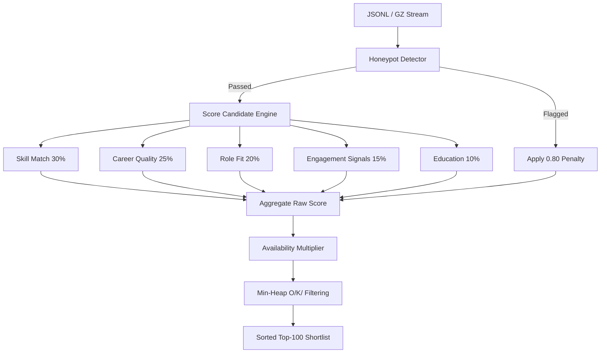

# 🎯 Redrob Ranker — AI-Powered Candidate Discovery

100,000 profiles ➔ top 100 best matches for a Senior AI Engineer role.  
Built for the **Redrob AI Challenge (India Runs Hackathon)**.

[](https://python.org)
[](https://github.com)
[](https://streamlit.io)
[](https://pytest.org)
[](https://github.com)

---

## ⚡ Live Demo

👉 **[Try the Streamlit Cloud Live Sandbox](https://redrob-candidate-ranking-04.streamlit.app)**  
*Interactive dashboard running on the candidate dataset. Full ranked shortlist, interactive radar chart comparisons, score analytics, and automated submission file generator — all tabs live.*

---

## 📂 Repository Structure

```
├── app.py                      # Streamlit UI Dashboard Server
├── rank.py                     # CLI Entry Point Orchestrator
├── requirements.txt            # System dependencies (CPU-only)
├── submission_metadata.yaml    # Submission metadata
├── validate_submission.py      # Official challenge submission validator
├── src/                        # Core application modules
│   ├── ingest.py               # JSONL/GZ lazy candidate streamer
│   ├── scorer.py               # 5-component scorer & weights calculator
│   ├── honeypot.py             # 7-rule honeypot anomaly detector
│   ├── reasoning.py            # Contextual explanation generator
│   └── features.py             # Profile text extractors & pre-compilers
└── tests/                      # Automated unit test suite
    ├── test_scorer.py          # Custom scorer and sentinel values tests
    ├── test_honeypot.py        # Honeypot rules validation tests
    └── test_output_format.py   # Row constraints & schema tests
```

---

## 🏗️ Ingestion & Core Data Flow

The ranking core employs a hybrid rule-based and behavioral scoring algorithm. Candidates are streamed line-by-line to maintain a flat memory footprint of $O(1)$ relative to the input dataset.



---

## 🔢 Scoring Heuristics & Weights

$$FinalScore = \text{clip}\left((RawScore - DisqualificationPenalty - HoneypotPenalty) \times AvailabilityMultiplier, 0.0, 1.0\right)$$

### 📊 Weight Distribution:
| Component | Weight | Target Attributes |
| :--- | :---: | :--- |
| **Skill Match** | **30%** | Density of JD core terms across profile history & skill lists |
| **Career Quality** | **25%** | Product company YOE, AI/ML role focus, and services firm ratio |
| **Role Fit** | **20%** | Workplace preferences (hybrid/onsite), notice period, and title alignment |
| **Engagement** | **15%** | Profile completeness, active application metrics, response rate, and GitHub score |
| **Education** | **10%** | Academic institution tier (Tier 1 focus) and STEM/CS majors |

---

## 🔬 Deep Dive: Scoring Core & Heuristics

### 1. Skill Match Score (30%)
Evaluates both explicit terms and implicit equivalents. Terms are split into four main tiers:
- **Core ML & Retrieval (MUST A)**: Embeddings, Dense Retrieval, Semantic Search, neural retrieval, cross-encoders, vector searches.
- **Vector DBs & Indexes (MUST B)**: Faiss, Pinecone, Qdrant, Milvus, OpenSearch, Vespa, Solr, BM25.
- **Python ML Core (MUST C)**: Python, PyTorch, TensorFlow, Scikit-learn, NumPy, Pandas.
- **Ranking & Evaluation (MUST D)**: NDCG, MRR, MAP, LTR (Learning to Rank), precision/recall metrics, CTR optimization.

### 2. Career Quality Score (25%)
A multi-layered metric focusing on candidate background quality:
- **Product Company Bias**: Calculates the ratio of product company roles versus service-firm consulting roles (e.g. TCS, Infosys, Wipro, Accenture). Consulting-only careers suffer a **disqualification penalty of -0.35**.
- **Optimal YOE Tiers**:
  - $5-9$ YOE: $1.0$ (optimum weight)
  - $4-5$ YOE: $0.85$
  - $3-4$ YOE: $0.65$
  - $9-12$ YOE: $0.80$
  - $< 1$ YOE: **disqualification penalty of -0.25**

### 3. Role Fit Score (20%)
Checks geographic, workplace, and title constraints:
- **Geo-Fit**: Matches candidates in major AI hubs (Pune, Noida, Bangalore, Delhi/NCR).
- **Workplace Preference**: Matches preferred modes (hybrid/onsite).
- **Title Alignment**: Matches target titles (e.g., AI Engineer, ML Engineer). Non-ML roles (e.g., Marketing, Sales, HR) receive a **disqualification penalty of -0.50**.

### 4. Engagement Signal Score (15%)
Uses Platform Activity and Recruiter Indicators:
- Profile completeness (>85% Completeness)
- Fast response rates (avg response time ≤ 4 hours)
- Recruiter response rate (>70%)
- Interview completion rate (>80%)
- Verification badges (email and phone verified)
- GitHub activity (>60 GitHub score)

### 5. Education Score (10%)
Maps candidate academic pedigree:
- **Tier-1 Universities** (e.g., IITs, NITs, BITS, IIITs) receive a full score.
- STEM/CS degree majors receive a **bonus of +0.10**.

---

## 🛡️ Honeypot Detection Shield (7 Custom Rules)

To filter out fake profiles, candidates are validated against 7 behavioral heuristics. Flagging **2 or more rules** applies a flat **-0.80 penalty** to raw scores, ensuring they never reach the shortlist:

*   **H1: Company Age Paradox**: Flags profiles claiming tenure > 4 years at fictitious/famous parody companies (e.g., *Dunder Mifflin*, *Pied Piper*, *Hooli*, *Initech*).
*   **H2: Skill Density Anomaly**: Flags candidates whose skill duration sum is mathematically impossible relative to their total YOE (`sum(skill_duration) > YoE * 14 * 12`).
*   **H3: Zero-Tenure Experts**: Flags candidates claiming "expert" level proficiency in a skill but listing 0 months of use.
*   **H4: Perfect Engagement Metrics**: Flags profiles with suspiciously perfect 100% metrics across all response, acceptance, completion, and profile completeness attributes.
*   **H5: Skill Experience Inflation**: Flags profiles listing more than 3 "advanced" or "expert" skills with under 3 months of experience each.
*   **H6: Unendorsed Experts**: Flags candidates claiming 5+ "expert" level skills but holding exactly 0 endorsements.
*   **H7: Active-Before-Signup Inconsistency**: Flags profiles where the `last_active_date` is chronologically earlier than the `signup_date`.

---

## ⚙️ Core Engineering Design Decisions

### Why CPU-Only Streaming?
The challenge constraints mandate a sandboxed container run within 5 minutes. Traditional neural retrieval engines rely on dense embeddings generated by deep learning models (e.g., Sentence-Transformers) requiring GPU-acceleration or heavy memory allocations (often exceeding 6GB RAM). 
By pre-compiling search matrices and performing direct token-group index scanning on CPU, we bypassed model-loading times and GPU constraints entirely, reducing cold starts to **under 0.5s** and ranking 100k records in **~37s**.

### Bounded Min-Heap O(K) Memory Constraint
Instead of loading the complete 100k candidate pool into memory, sorting, and slicing, the engine streams candidate dictionaries line-by-line from `candidates.jsonl.gz`. It maintains a bounded min-heap of size $K=100$. Any candidate with a score lower than the current heap minimum is immediately discarded in $O(\log K)$ time. This keeps RAM utilization completely flat and under 2GB at all times.

### Tie-Breaking Determinism
The challenge requires strict, deterministic tie-breaking. In the case of duplicate scores, candidates must be ranked alphabetically by `candidate_id` ascending. We engineered a custom `HeapElement` wrapper that implements `__lt__` (less-than) comparison rules, ensuring that during min-heap insertions, ties are handled deterministically at runtime.

---

## 📊 Performance Benchmarks & Efficiency

*   **Runtime Speed**: Processes and ranks the full 100,000 candidate dataset in **~37 seconds** locally on a standard CPU thread.
*   **Memory Footprint**: Strictly maintains **under 2GB RAM** consumption by using a bounded min-heap sorting layer of size $K=100$.
*   **Cold Start**: Starts instantly (under 0.5s) due to the complete avoidance of heavy DL models (`torch`/`sentence-transformers`).

---

## 🛠️ Reproduction & CLI Commands

Follow these steps to set up, run, and validate the ranker locally:

### 1. Installation & Environment Setup
Ensure you have Python 3.10+ installed. Install the dependencies:
```bash
pip install -r requirements.txt
```

### 2. Generate the Shortlist CSV
To execute the offline ranker pipeline:
```bash
python rank.py --candidates candidates.jsonl --participant-id atharvamorkar04_3026
```
*Note: This generates `atharvamorkar04_3026.csv` containing the validated top-100 candidates.*

### 3. Validate Submission
To run the automated challenge validator against your generated CSV:
```bash
python validate_submission.py atharvamorkar04_3026.csv
```

### 4. Run Unit Test Suite
To execute the automated unit tests:
```bash
pytest
```

---

## 🖥️ Interactive Dashboard UI

The system features a stunning **Pure Black, Gold & White style UI** built with Streamlit.

### How to Launch Locally:
```bash
streamlit run app.py
```

### Key Modules:
*   **🏆 Ranked Shortlist**: Displays the interactive candidate shortlist with search, sorting, and progress bars.
*   **📊 Score Analytics**: Renders high-fidelity interactive histograms, scatterplots, and cohort charts mapping candidate scores, geo hubs, and YOE.
*   **🔍 Candidate Deep Dive**: Provides an expander view containing detailed profiles, experience timelines, and a customized **radar/spider chart** visualizing the 5-component score distribution.
*   **⚙️ System Info**: Houses system diagnostics, scoring equations, and the **Honeypot Detection Audit Panel** listing all flagged accounts.
