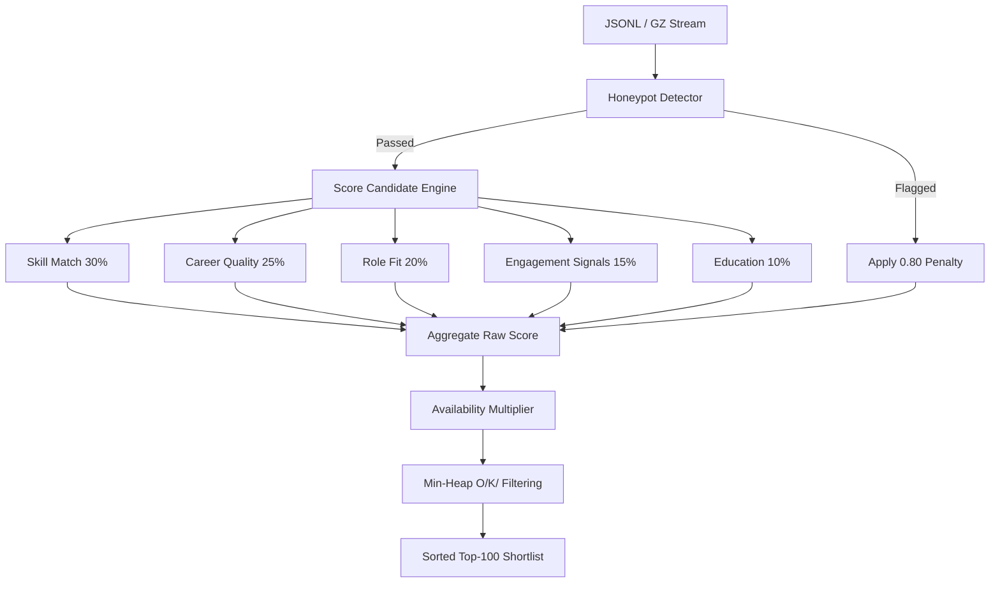

# REDROB RANKER: Advanced Candidate Discovery & Shortlisting Core
### (Individual Participant Edition)

An enterprise-grade, high-performance offline CPU candidate-ranking engine designed to ingest, validate, score, filter, and rank 100,000+ candidates against a Senior AI Engineer job description. Built using an $O(K)$ space-complexity streaming min-heap architecture to ensure instant scalability on standard hardware (under 16GB RAM, no GPU required, zero network dependencies).

---

## 🏗️ Architecture & Scoring System

The ranking core employs a hybrid rule-based and behavioral scoring algorithm. Candidates are streamed line-by-line to maintain minimal memory consumption.



### 🔢 Scoring Formula

$$final\_score = \text{clip}\left((\text{raw\_score} - \text{disqualification\_penalty} - \text{honeypot\_penalty}) \times \text{availability\_multiplier}, 0.0, 1.0\right)$$

Where:
*   **Skill Match Score (30%)**: Evaluates explicit/implicit concepts matching embeddings, retrieval pipelines (dense, hybrid, neural), vector search/stores (Faiss, Pinecone, Qdrant), production Python tools, and ranking evaluation metrics (NDCG, MRR, MAP@).
*   **Career Quality Score (25%)**: Emphasizes product company pedigree, current role AI focus, and optimal YOE (5–9 yr ideal). Penalizes IT Services consulting backgrounds.
*   **Role Fit Score (20%)**: Checks structural title fit, Indian location hubs (Pune, Noida, Bangalore, Delhi/NCR), notice periods, and hybrid/onsite work preferences.
*   **Engagement Signal Score (15%)**: Measures platform completeness, recruiter response rate, email/phone verification, and GitHub activity.
*   **Education Score (10%)**: Weights university tier (tier 1 vs others) and STEM/CS majors.
*   **Availability Multiplier**: Softened behavior penalizing inactive candidates gently (0.80x for 180+ days, 0.65x for 365+ days) and flagging unresponsive behavior.
*   **Honeypot Detection**: Heuristic engine targeting company durational discrepancies, duration overlaps, zero-month experts, and automated response rates. Flagged profiles suffer a flat `-0.80` penalty.

---

## 🛠️ Reproduction & CLI Commands

Follow these steps to setup, run, and validate the ranker locally:

### 1. Installation & Environment Setup
Ensure you have Python 3.10+ installed. Install the dependencies:
```bash
pip install -r requirements.txt
```

### 2. Generate the Shortlist CSV
To execute the offline ranker pipeline:
```bash
python rank.py --candidates candidates.jsonl --participant-id atharvamorkar04_3026
```
*Note: This generates `atharvamorkar04_3026.csv` containing the validated top-100 candidates.*

### 3. Validate Submission
To run the automated challenge validator against your generated CSV:
```bash
python validate_submission.py atharvamorkar04_3026.csv
```

### 4. Run Unit Test Suite
To execute the automated unit tests:
```bash
pytest
```

---

## 🖥️ Interactive Dashboard UI

The system features a stunning **Pure Black, Gold & White OpenAI/Anthropic style UI** built with Streamlit.

To launch the dashboard locally:
```bash
streamlit run app.py
```

### Dashboard Highlights:
*   **🏆 Ranked Shortlist**: Displays the interactive candidate shortlist with search, sorting, and progress bars.
*   **📊 Score Analytics**: Renders high-fidelity interactive histograms, scatterplots, and cohort charts mapping candidate scores, geo hubs, and YOE.
*   **🔍 Candidate Deep Dive**: Provides an expander view containing detailed profiles, experience timelines, and a customized **radar/spider chart** visualizing the 5-component score distribution.
*   **⚙️ System Info**: Houses system diagnostics, scoring equations, and the **Honeypot Detection Audit Panel** listing all flagged accounts.
